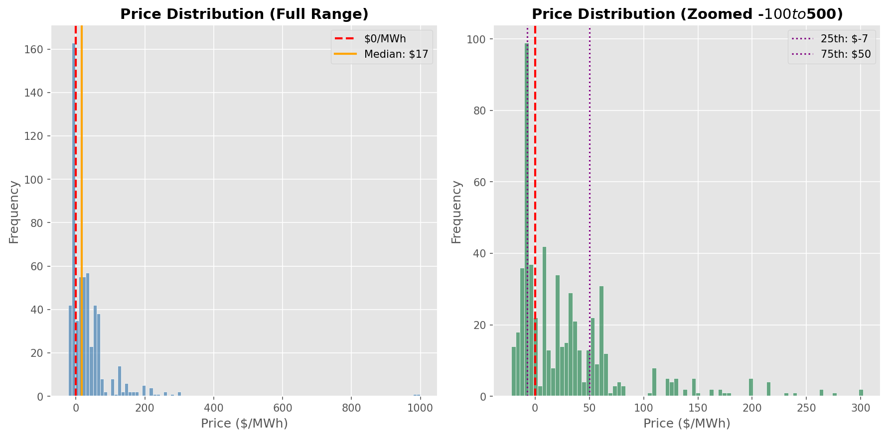
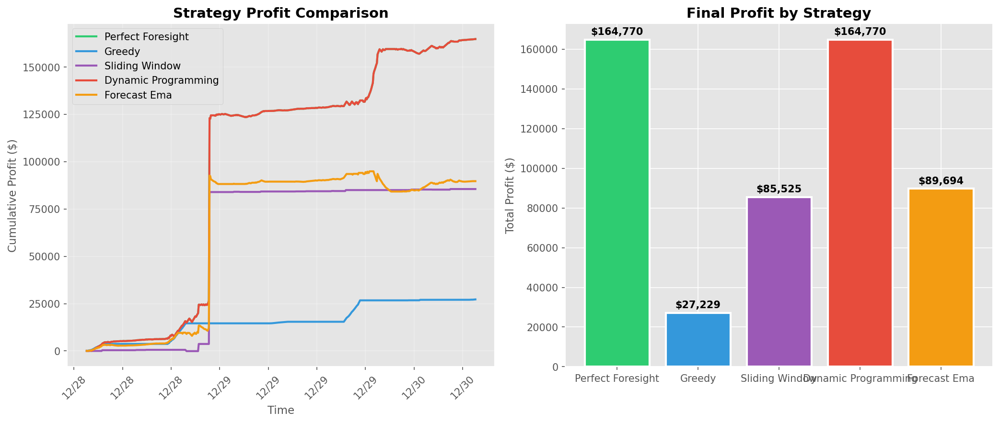
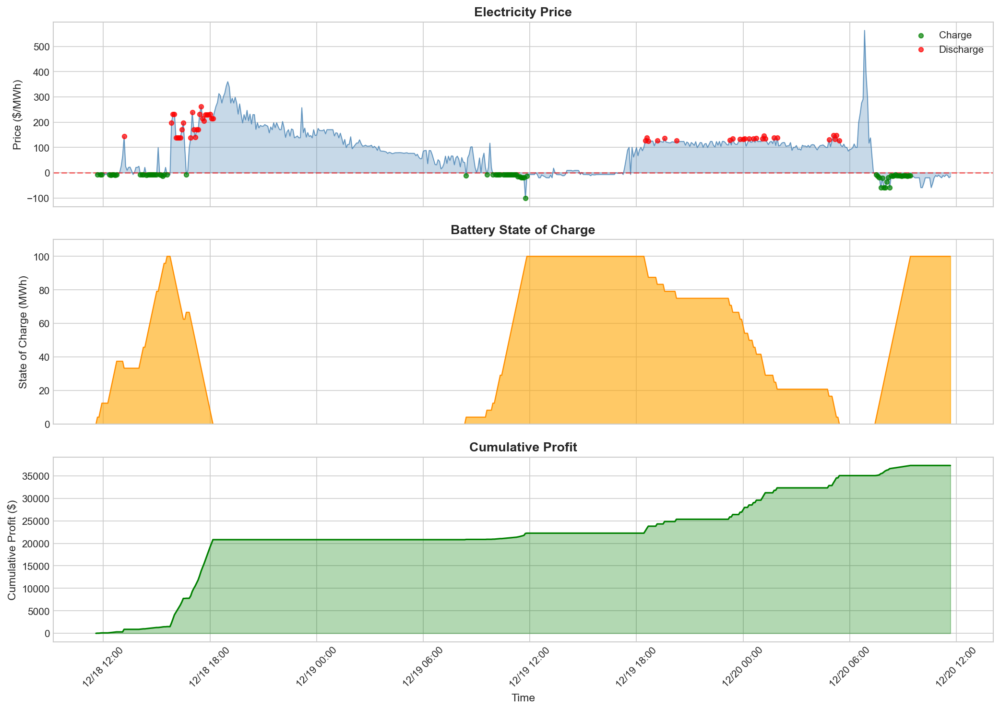

# NEM Price Forecasting

## Problem Statement

Australia's National Electricity Market (NEM) experiences extreme price volatility, with prices swinging from -$1,000 to +$16,000 per MWh within hours. Battery arbitrage can profit by charging during price troughs and discharging during spikes, but which algorithm maximizes returns?

This project benchmarks multiple trading strategies using real AEMO dispatch data to find the optimal approach for battery arbitrage.

---

## What I Built

A simulation engine that:
- Downloads and processes real 5-minute dispatch price data from AEMO
- Models battery physics (capacity, power limits, round-trip efficiency)
- Implements 5 trading strategies of varying complexity
- Includes EMA-based price forecasting for predictive trading
- Visualizes performance and generates profit comparisons

---

## Dataset

| Attribute | Details |
|-----------|---------|
| Source | [AEMO NEMWEB](https://nemweb.com.au/) |
| Granularity | 5-minute intervals |
| Regions | SA1, NSW1, VIC1, QLD1, TAS1 |
| Target Variable | Regional Reference Price (RRP) in $/MWh |

---

## Tech Stack

- **Language:** Python
- **Libraries:** Pandas, NumPy, Matplotlib, Requests, BeautifulSoup4
- **Techniques:** Dynamic programming, sliding window algorithms, threshold-based trading

---

## Methodology

### Trading Strategies Implemented

| Strategy | Complexity | Approach |
|----------|------------|----------|
| Perfect Foresight | O(n*m) | Dynamic programming upper bound using future knowledge |
| Greedy Threshold | O(n) | Buy below price X, sell above price Y |
| Sliding Window | O(n*k) | Local min/max detection within time window |
| Dynamic Programming | O(n*m) | Optimal decisions with discrete SoC states |
| Forecast (EMA) | O(n) | Predictive trading based on exponential moving average |

### Battery Model
- Configurable capacity (default: 100 MWh)
- Configurable power rating (default: 50 MW)
- Round-trip efficiency losses (default: 90%)

---

## Results

**Test Configuration:** SA1 Region, 100 MWh / 50 MW Battery

| Strategy | Profit | Charge Cycles | Discharge Cycles |
|----------|--------|---------------|------------------|
| Perfect Foresight | $164,982 | 248 | 228 |
| Greedy | $27,975 | 65 | 49 |
| Sliding Window | $85,525 | 11 | 11 |
| Dynamic Programming | $164,982 | 248 | 228 |
| Forecast Ema | $89,030 | 204 | 181 |

**Key Insight:** Perfect Foresight provides the theoretical upper bound at $164,982. The greedy strategy achieves ~17% of optimal. Last updated: 2025-12-29 22:14 UTC.

---

## Visualizations





---

## Quick Start

```bash
# Install dependencies
pip install pandas numpy matplotlib requests beautifulsoup4

# Run with default settings
python main.py

# Specific region
python main.py --region SA1

# Custom battery parameters
python main.py --capacity 200 --power 100 --efficiency 0.85

# Run without charts
python main.py --no-charts
```

---

## Project Structure

```
nem-price-forecasting/
├── data/                    # AEMO price data (auto-downloaded)
├── src/
│   ├── data_loader.py       # Data parsing and preprocessing
│   ├── battery.py           # Battery physics model
│   ├── strategies/          # Trading algorithm implementations
│   └── visualizer.py        # Chart generation
├── download_aemo_data.py    # AEMO data fetcher
└── main.py                  # Entry point
```

---

## Key Learnings

- Simple strategies can outperform complex approaches in highly volatile markets
- 5-minute data granularity captures price spikes that hourly data would miss
- Round-trip efficiency losses significantly impact viable trade frequency

---

## Limitations

- No weather or demand forecast integration
- Assumes perfect execution without slippage or grid constraints
- Historical backtesting only; past performance does not guarantee future results

---

## Future Improvements

- Integrate Bureau of Meteorology weather forecasts
- Add LSTM or Transformer-based price prediction model
- Implement reinforcement learning for adaptive strategy selection
- Extend to multi-region arbitrage optimization
- Real-time trading signal API

---